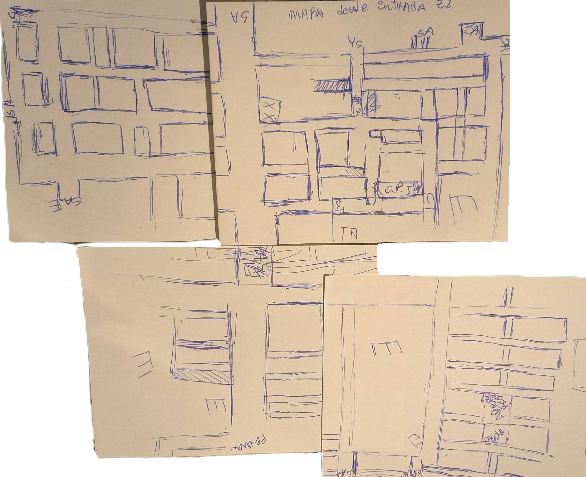
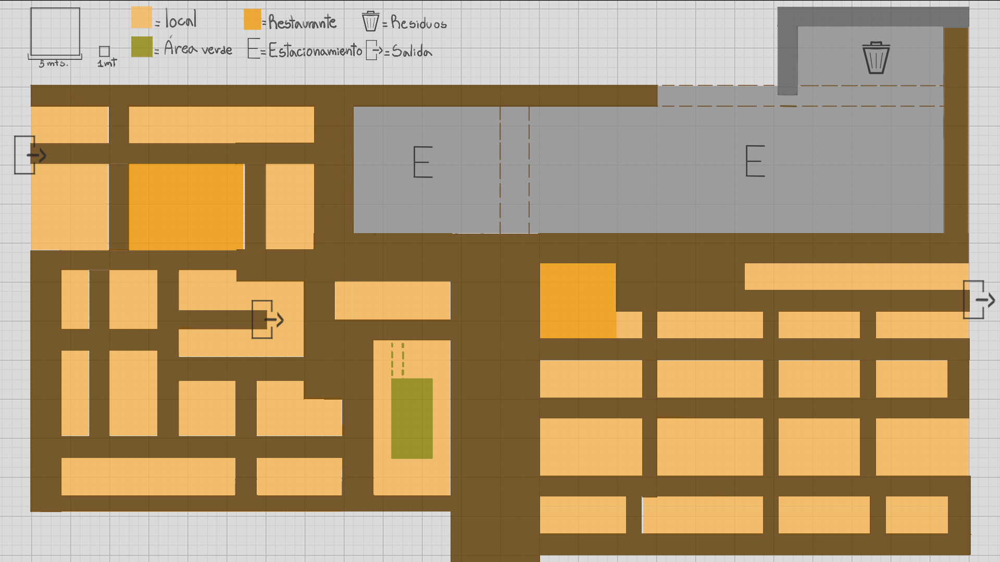
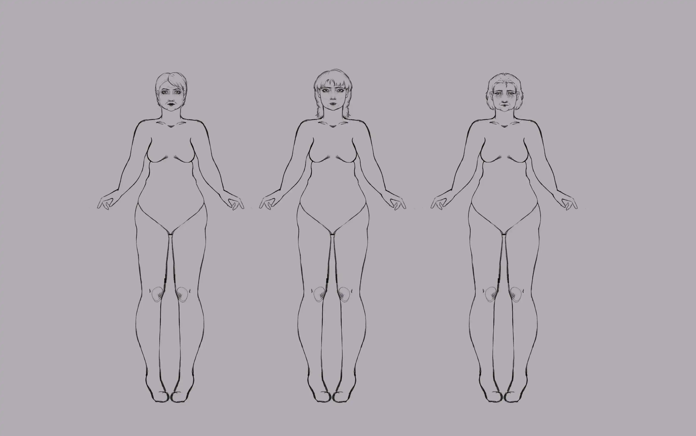
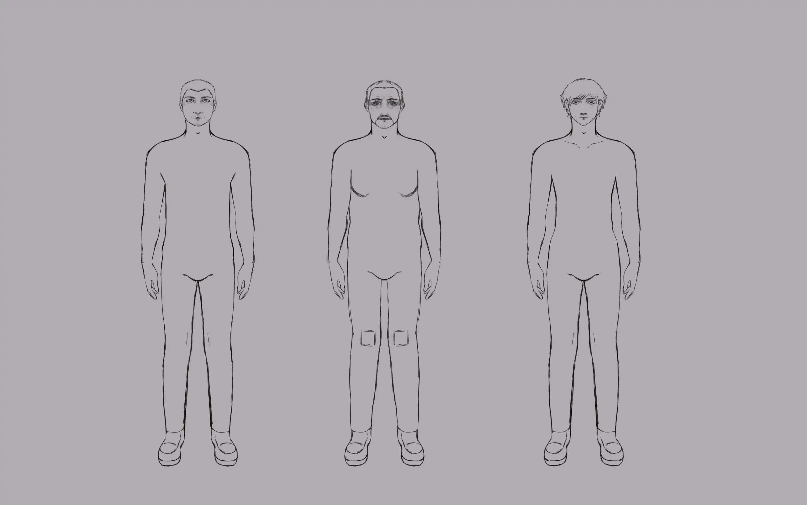
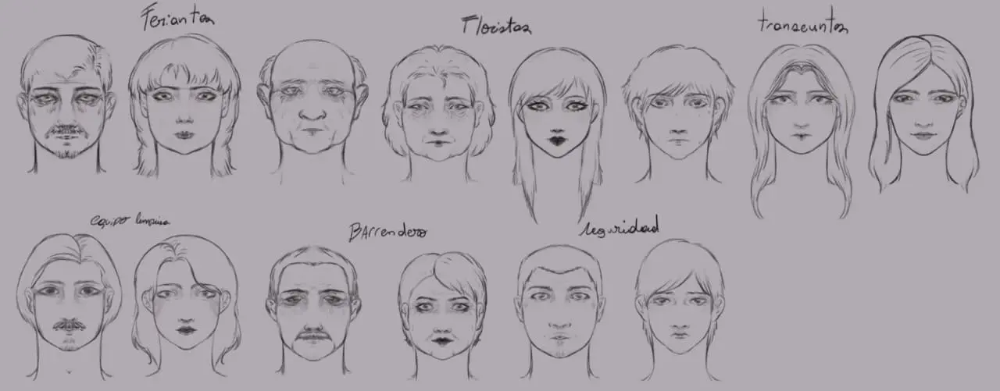

Hola hola, acá el equipo de arte de Plants path collective. 

Esta semana nuestro equipo dio de lleno con la conceptualización de los espacios dentro de la Merna. Para hacer que fuera lo más cercano a los mercados establecidos latinoamericanos posible, nos inspiramos en uno de los mercados más populares de Santiago de Chile. Pero al hacer esto nos topamos con un gran problema; no existen mapas actuales de este mercado (o al menos no que los compartan al público).  Es por esto por lo que tuvimos que ir a terreno a mapear este mercado, aunque quizás mapear suena 	un poco muy serio en comparación a lo que fui a hacer al mercado. 

(Caminar pasillo a pasillo con una croquera y tratar de plasmar en papel cada pasillo e intersección fue lo más cercano a mapear que pude lograr, un trabajo estresante si tienes ansiedad social como yo.) 

Pero pese a todo, se logró el cometido. Tras esto se procedió a hacer un concepto de mundo y mapa que tuviera todos los elementos necesarios para que sea un espacio interactivo y al mismo tiempo se sienta vivo. 

Otra de las tareas que como equipo de arte nos enfrentamos fue a la de comenzar a conceptualizar a los personajes secundarios. ¿Quién diría que para tener un mundo que se sienta vivo en un mercado necesitas hacer que los mercaderes tengan personalidad visual? 

Este trabajo fue llevado a cabo por mi compañera Benz, quien hizo distintos rostros tanto de mujeres como de hombres, también distintas morfologías corporales para así poder abarcar las distintas personas que una persona podría encontrarse en un mercado de abastos.

Otro apartado sumamente importante que debíamos llevar a cabo al conceptualizar personajes era hacer el arte conceptual de los Hunters, ósea quienes los acompañaran a ustedes como jugadores en el mundo, definitivamente es necesario que sean reconocibles y al mismo tiempo nos gustaría que se viera reflejado en su apariencia, una parte de la personalidad del personaje. El problema de esto es que los Hunters vienen de distintas dimensiones y por ende tienen muy diferentes apariencias. Tres de los Hunters fueron diseñados por Benz, hubo solamente uno de estos que se me paso a mi para darle una vuelta. Más que nada porque como equipo no nos convencía del todo su primer diseño.

Tambien decidirmos dividirnos las dos facciones enemigas para realizar los artes conceptuales de forma equitativa como equipo. Benz viendo la línea temporal del futuro y su humilde servidor viendo la línea temporal del pasado. Otra tarea que nos propusimos es realizar el arte conceptual de los distintos objetos equipables para esta semana y tener arte conceptual de los distintos espacios dentro de la Merna.

Una vez se tenga la totalidad del arte conceptual de espacios dentro de la Merna se procederá a realizar un blockout del espacio con formas geométricas base para entender las dimensiones en un espacio 3D.

De todas maneras, como equipo de arte entendemos que es muy posible que el arte conceptual sufra cambios en un futuro. Pero dicho esto, muchas gracias por haberme acompañado en esta entrada. Para más información del proyecto no te olvides de visitar nuestras redes sociales.

Se despide su humilde servidor Korii.