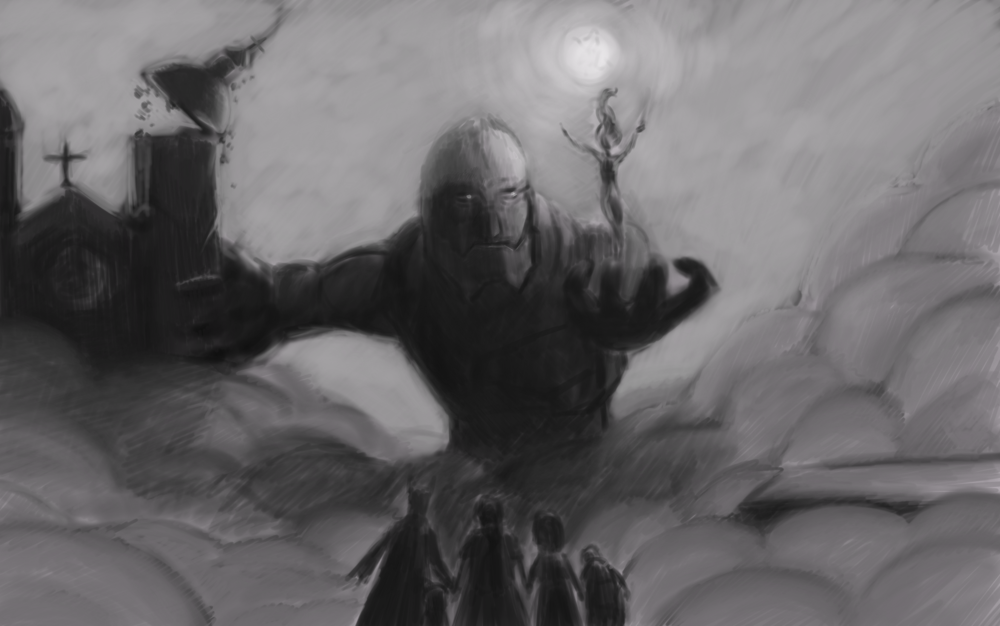
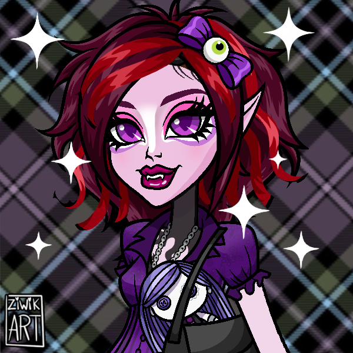
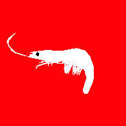
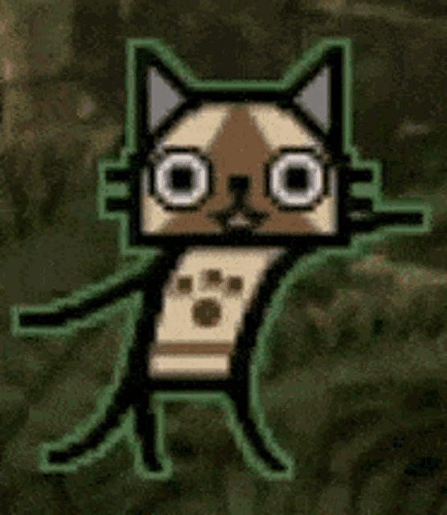

Buenas, aquí Marchel, fundador de Plants Path Collective. En esta ocasión vengo a presentarles lo que sería ya nuestra web en si, lleva un tiempo en línea pero no la habiamos promocionado anteriormente.

Antes que nada, queremos hablarles un poco sobre que es Plants Path Collective o conocido como PPCo, este es un estudi desarrollador de videojuegos indie Chileno, compuesto actualmente por estudiantes de Diseño de Juegos, fundado alrededor de Agosto del 2023, partio como un grupo pequeño para presentar los diferentes trabajos / juegos a el resto de compañeros de nuestra carrera, a pesar de que la mayoria de integrantes de ese entonces no sigue en el estudio, seguimos desarrollando jueguitos de diferente tipo, siempre buscando experimentar pero trayendo juegos que nos parecen divertidos y con personajes con los que puedas encariñarte; es por ello, que hoy venimos a presentarles nuestro nuevo proyecto.

## Los Hunters están de vuelta!

Tal como lo dice el título, estamos trabajando en una nueva entrega para la saga Hunters!

Anteriormente desarrollamos Hunters: Awakening, un JRPG 2D Pixel Art con combates por turnos donde tomabas el rol de Javiera, una adolescente chilena que visitaba la isla Chirrica durante la década de los 80. Allí, una serie de asesinatos y extrañas tormentas comenzaban a alterar la tranquilidad de la isla, hasta que Javiera conoce a Brook, un cazarecompensas perteneciente a la Hunter Association.

La Hunter Association es una organización dedicada a mantener el equilibrio entre las distintas dimensiones e intervenir cuando algo amenaza con inclinar demasiado la balanza. Y aunque en Awakening apenas comenzábamos a conocer este mundo, esta vez decidimos mirar un poco más hacia el futuro.

Veinte años después de los sucesos de Chirrica, en la Dimensión Terra (DIM-4521283782109), algo extraño está ocurriendo en Santiago de Chile.

En uno de los lugares más conocidos de la ciudad, el Mercado Central de Abastos, extrañas fluctuaciones temporales comienzan a manifestarse. El lugar, conocido como La Merna, parece estar atrapado en algo que no debería existir.

Y claro, cuando algo así ocurre, la Hunter Association no puede simplemente mirar hacia otro lado.

Es así como un grupo de Hunters de la División de Investigación llega a La Merna para descubrir qué está pasando.

Y probablemente deberían haber llegado antes.

---

## Hunters: Fractura del Tiempo

Esta vez quisimos hacer algo un poco diferente.

Hunters: Fractura del Tiempo es un JRPG Roguelite en 3D con combates por turnos, ambientado en un mercado de Santiago atrapado dentro de una anomalía temporal conocida como la Fractura.

El tiempo ya no parece avanzar como debería.

Los Hunters tienen solo tres días para explorar La Merna, hablar con sus habitantes, investigar sus acontecimientos y seguir las pistas que puedan explicar qué está ocurriendo. Pero cada vez que el ciclo termina, todo vuelve a comenzar.

O al menos, eso es lo que parece.

Mientras investigas el mercado, vas a encontrarte con acontecimientos que no deberían estar ahí. Personas que aparecen donde no deberían, lugares que parecen cambiar y señales de que algo mucho más grande está ocurriendo detrás de la Fractura.

Y entre todo esto, están las líneas temporales paralelas, realidades que comienzan a filtrarse en La Merna a medida que la anomalía se vuelve más inestable.

También están las Alcantarillas.

Una mazmorra procedural que se encuentra bajo el mercado y que, además de estar llena de enemigos, puede esconder nuevas piezas para entender qué ocurrió realmente.

La idea es que nunca tengas toda la respuesta de inmediato. Queremos que poco a poco vayas armando el rompecabezas, conectando pistas y descubriendo que algunas cosas quizá no son exactamente como parecen.

Así que sí, los Hunters están de vuelta.

Pero esta vez, algo salió muy mal en La Merna.

Y queremos que seas tú quien descubra qué fue.

---

## Conoce a los Plantíferos!

El proyecto acaba de salir de la fase de preproducción y actualmente está siendo desarrollado por un grupo de cuatro diseñadores, programadores y artistas.

    
    
Korii

    
Artista 2D y 3D

    
    
Benz

    
Artista 2D y 3D

    
    
Marchel

    
Programador

    
    
Ame

    
Programadora

Además, contamos con el docente Jorge Huerta como profesor guía del proyecto.

Este será el proyecto de título que presentaremos para nuestra carrera y, posteriormente, esperamos continuar su desarrollo para lanzar una demo durante el año **2027**, aún esta pendiente la fecha exacta.

---

Muchas gracias por acompañarme en la lectura de este devlog. Espero que te haya gustado y, si quieres saber más sobre el desarrollo de Hunters: Fractura del Tiempo, recuerda seguirnos en nuestras redes sociales para mantenerte al tanto de nuevas noticias y futuros devlogs como este.

Yo soy Marchel, y espero que tengas un lindo día o/