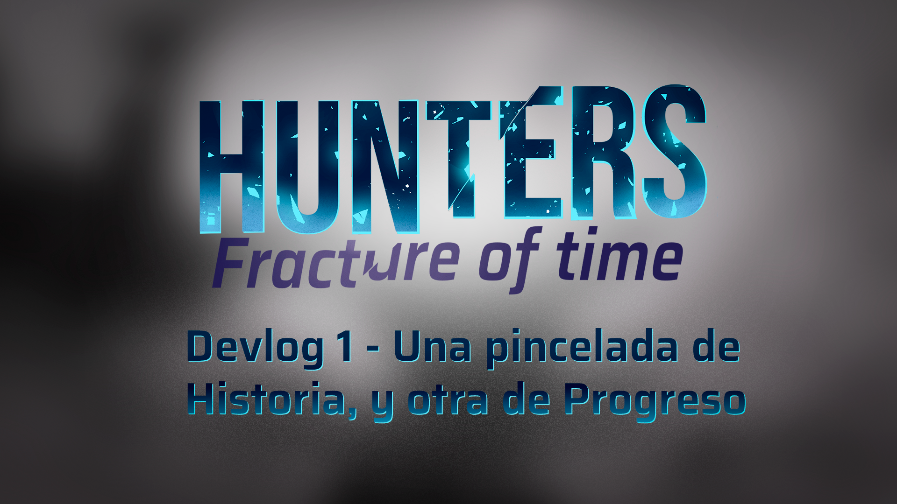

Durante estas últimas semanas hemos estado cerrando varios puntos de la preproducción de Hunters: Fractura del Tiempo, y finalmente estamos comenzando a dar nuestros primeros pasos hacia el prototipo. Esto también significó sentarnos a revisar algunas de las ideas que teníamos desde hace tiempo y preguntarnos: ¿realmente queremos hacer todo esto? Spoiler: no nos da el tiempo ^^'

Entre los cambios más importantes se encuentra la reducción del bucle temporal de siete a tres días, la revisión de las facciones que formarán parte de la primera demo y una nueva forma de plantear la progresión mediante objetos.

Por el lado de narrativa, también comenzamos a replantear las facciones y sus historias, buscando nuevas formas de representar nuestras versiones alternativas de Chile. Una de ellas, en particular, nos llevó a explorar la Independencia de Chile, la religión y un pequeño pacto que probablemente no debió hacerse.

Así que en este Devlog hablaremos un poco de todo esto: objetos, progresión, cambios al bucle temporal y, por supuesto, las nuevas ideas que estamos desarrollando para nuestras facciones.

Como siempre, tengan en cuenta que Hunters todavía está en desarrollo, así que algunas de estas ideas pueden cambiar o terminar completamente descartadas más adelante. La idea de estos Devlogs es justamente mostrarles ese proceso mientras construimos el juego.

¡Esperamos que disfruten la lectura! o/

---

## ¿Cómo funciona el progreso?

Tomando de referencia juegos como Risk of Rain y THe Binding of Isaac, en Hunters Fracture decidimos que el sistema de progresión, no estuviese basado en niveles como otros JRPGs, es por ello que mirando hacia al lado encontramos a los Roguelites como RoR u Isaac, juegos en los que el jugador juega partidas y obtiene items para potenciar a su personaje, sin embargo, perdiendo practicamente todo al perecer, pero pudiendo desbloquear ciertos personajes, skins o similares tras cada partida en base a ciertos logros conseguidos.

Para Hunters Fracture, decidimos que seria buena idea mantener el progreso o desbloqueo de items, que se añadirian a la pool, y skins o personajes que se añadirian tras desbloquear estos Desafíos como los nombramos; mientras que refiriendonos a los objetos, llegamos a definirlos en dos categorías: los consumibles, veanse pociones, buffs en formas de pociones, entre otros; mientras que por otro lado, estarían los pasivos, estos se asemejarían más a los objetos de Risk of Rain, donde el jugador puede obtenerlos y acumularlos prácticamente infinitamente, dandole esa satisfacción de romper el juego si así lo desea. Vale mencionar que algunos items afectaran a los personajes dependiendo de donde se ubican en el campo de batalla (Ej: este item le da un bono a un personaje a tu izquierda) Refiriendonos a estos últimos, queremos hablar de sus rarezas o tiers, los cuales serian los siguientes tres:

- **Comunes**: Pueden modificar las estadísticas, aplicar efectos al impactar y reducir el coste de SP de las habilidades.
- **Raros**: Pueden modificar comportamientos de ataques y habilidades de los personajes, también pueden aplicar cambios de estados, y buffs en general.
- **Únicos**: Cambian las reglas del combate, permiten cambiar estadísticas, como actuan los Aliados u Enemigos, entre otras cosas. A diferencia de los otros tiers, no pueden stackearse, debido a que solo existe 1 copia de cada objeto único en el mundo.

En total, la primera demo contaría con alrededor de **14** objetos, siendo estos: **2** únicos, **4** raros, y **8** comunes.

Aquí algunos de los que tenemos para calmar las ansias:

  

      
Objeto

      
Rareza

      
Historia

      
Efecto

  

  

    
Muñeca de Porcelana

    

        Común
    

    

        Una antigua muñeca de porcelana, heredada de generación en generación, observa silenciosamente el puesto, custodiando recuerdos familiares entre frutas y voces.
    

    

        Aumenta la fuerza del portador en un 25% (+10% por copia), disminuye la defensa física y la defensa mágica, del portador, en un 15% (+10% por copia).
  

  

  

    
Reproductor de CD

    

        Raro
    

    

        Reproductor de CD de segunda o tercera mano, ha sido usado durante tanto tiempo, que tiende a rayar los CDs que reproduce, rebobinandolos de vez en cuando.
    

    

        Al atacar o usar una habilidad, 10% (+5% por copia) de probabilidad de repetir el turno del portador, justo después de este.
  

  

---

## Pero, ¿De qué va Hunters Fracture?

Originalmente se tenía pensado que las diferentes facciones de ese entonces (Ocultistas, Mafiosos, Corpos, y Cyborgs), tras la derrota de la Afligida, se peleasen entre sí, con el fin de obtener el poder de la Fractura, ante esto, la asociación ordena al grupo enviado, a defender la Fractura y mantener el balance en la dimensión, mientras que ellos envían refuerzos cada cierto tiempo; la idea principal de esta trama, era tener un final abierto, con posibilidad de traer actualizaciones u DLCs al juego base, con el fin de monatr un endgame y tener una mayor rejugabilidad.

Sin embargo, con el recorte del scope para la primera Demo, en el cual se pasó de tener un loop temporal de 7 días a uno de 3, se decidió reducir la cantidad de facciones, combinando y consolidando algunas, mientras que por otro lado, se tendría que reescribir el storyline para replantear como las diferentes facciones se presentaban durante la historia al jugador.

---

## ¿Qué hay de las facciones?

Como comentamos anteriormente, los objetos únicos se podrían obtener de ciertas misiones correspondientes a las entregadas por facciones, estas serían diferentes interpretaciones de cómo podría ser Chile, si es que hubiese cambiado algo en su historia, esto desde un punto de vista ficticio y fantastico, obviamente. 

A la primera de ellas se le conoce como _La Republica Unificada Chilena_.

---

### La Republica Unificada Chilena

“El golpe de estado ha fallado” es la declaración de triunfo del ex-presidente Salvador Allende tras el fallido golpe de estado de parte del ejército Chileno el 11 de septiembre de 1973. Chile trás el fallido golpe de estado cambió radicalmente de posición en el mundo, el aparentemente amigable EEUU se había opuesto a la república socialista de Chile y buscó sabotear no solo su economía si no su gobierno en varias oportunidades, exagerando los preexistentes problemas económicos al llegar a fines de los años 70.

Lo que ocurrió después es lo que hoy es conocido como el milagro de la gente, si bien la economía efectivamente estaba mal, el término de varios proyectos importantes de infraestructura como Cybersyn, trenes, educación pública y salud pública junto al apoyo de la URSS y un alza en el precio del cobre nos llevó a un punto de quiebre, los sueldos estaban subiendo y las personas se estaban educando, Chile se estaba independizando. La subsecuente industrialización es la más impresionante jamás vista en Sudamérica, estableciendo a Chile como un superpoder no solo de minería si no de bienes derivados de esta.

Todo esto llevaba un costo sin embargo, la percibida traición de los EEUU junto a varios intentos de parte de extremistas de derecha dejó un estigma contra cualquier creencia que derivara del materialismo y el socialismo, esta censura no era sólo mantenida por el gobierno, si no por la mismo sociedad que portaba las cicatrices de hace tanto tiempo. Tras la caída de la URSS esto se alivió levemente ya que el país se abrió a la globalización, que fuera de ser una importante oportunidad económica y tecnológica significó la apertura a otras ideas, dentro de estos el que mas destaca es la linea capitalista neoliberal, la predominante en el mundo y por ende la que mas amenaza el estatus quo, cosa que se ve exagerada por la riqueza natural del país ya que muchos inversores externos ven a Chile como una oportunidad sin explotar. 

Pese a todo lo dicho, la república socialista de Chile es, a ojos externos, un absoluto éxito con un pueblo libre, educado y protegido dentro de uno de los países más tecnológicamente avanzados y prósperos en todo el mundo.

Si fueras a ir a Santiago en la actualidad verías calles limpias, un sistema completo de transporte público y bastantes edificios altos y utilitarios pintados de colores simples, todo esto junto a casonas tradicionales que han sido mantenidas con gran esfuerzo en su estado histórico original. En mercados te encontrarás con estructuras orgánicas retrofuturistas presentadas en grandes espacios abiertos que evocan el antiguo mercado o la moderna Merna. En cuanto a monumentos es poco común ver monumentos que glorifican una persona, si no es más común ver a los que glorifican un colectivo, personas moviéndose como grupo contra un enemigo común, sea este figurativo o literal. Por último, las oficinas y sitios de mayor avance tecnológico evocan el todavía activo proyecto Cybersyn, con figuras orgánicas, limpias y llamativas en salas abiertas con poca división y claros sitios para convivencia o discusión.

---

Por otro lado, tenemos a...

### La Santa Franja
En cuanto a la segunda facción, esta tendría un desvío en su pasado y se enfocaría en la época de la Independencia de Chile. Queríamos retratar su conexión con la Iglesia, el fanatismo religioso y otros elementos relacionados con este contexto. Una de las ideas que surgió durante el desarrollo fue tomar como referencia la fuerte devoción religiosa presente durante la Independencia y, particularmente, la relación de los patriotas con una figura sagrada asociada a la identidad nacional.

Para evitar representar directamente una religión o figura religiosa real dentro del juego, decidimos transformar esta referencia en una figura sagrada ficticia y local. De esta manera, la facción conservaría la inspiración histórica y visual que buscábamos, pero tendría su propia identidad dentro del universo del juego.

La primera idea que investigué fue la de un Estado totalitario, tomando como referencia la propuesta de Ame de utilizar *1984*. Como esta nueva facción surgiría a partir de una remodelación de la facción de los Ocultistas, también quería mantener una conexión con su concepto original y continuar su línea temática, pero llevándola hacia un contexto diferente.

A partir de esto, llegué a la idea de que durante la Independencia de Chile, tras la derrota de Cancha Rayada, los patriotas recurrirían a un antiguo ritual bajo la advocación de esta figura sagrada local. Sin embargo, aquello con lo que realmente entrarían en contacto no sería la figura que veneraban, sino una entidad desconocida. El pacto cambiaría el curso de la guerra y permitiría la victoria en Maipú, pero sus efectos no terminarían allí.

Con el paso del tiempo, la entidad comenzaría a traer prosperidad al país. Los enemigos y opositores del Estado desaparecerían, las riquezas aumentarían y la nación alcanzaría una estabilidad aparentemente extraordinaria. Sin embargo, la entidad exigiría cada vez más a cambio de mantener estos beneficios. El Estado comenzaría entonces a cerrarse sobre sí mismo, volviéndose progresivamente más autoritario y estricto, hasta terminar fusionando su estructura con la Iglesia. La religión dejaría así de ser una cuestión de fe para convertirse en una verdadera doctrina de Estado.

En la actualidad, la situación se ha vuelto mucho más oscura. La entidad se ha vuelto incontrolable y extrañas criaturas merodean durante la noche, provocando desapariciones inexplicables. El Estado intenta mantener estos acontecimientos en secreto, silenciando a quienes investigan y reprimiendo cualquier intento de cuestionar la versión oficial. Ante el resto de la población, el país continúa proyectando una imagen de orden, prosperidad y perfección.

Al mismo tiempo, el régimen restringe el contacto con el exterior e intenta impedir que extranjeros, nuevas ideas o cualquier elemento contrario a su doctrina ingresen al país. De esta forma, la población permanece aislada y desconoce hasta qué punto la estabilidad de la nación depende del pacto realizado siglos atrás.

---

## Qué viene después?

Con esto estamos encaminándonos a la producción como tal. Todavía quedan muchas cosas por definir y varios de estos elementos continuarán evolucionando a medida que avancemos con el prototipo, pero poco a poco estamos comenzando a darle una forma más concreta a la primera demo/alpha que queremos tener para fines de Septiembre.

En el próximo devlog dejaremos un poco de lado los sistemas para centrarnos en el apartado artístico. Presentaremos a los protagonistas de Hunters: Fractura del Tiempo y compartiremos algunas de las piezas de concept art que hemos estado desarrollando para enemigos, facciones y otros elementos del mundo.

Y después de eso, durante las próximas semanas, entraremos de lleno en uno de los sistemas más importantes del juego: el combate. Hablaremos sobre cómo funciona a nivel jugable, cómo se relacionan los personajes con este sistema y algunas de las mecánicas que estamos desarrollando para el juego en general.

Por ahora, muchas gracias por acompañarnos en este proceso. Nos vemos en el próximo devlog! o/